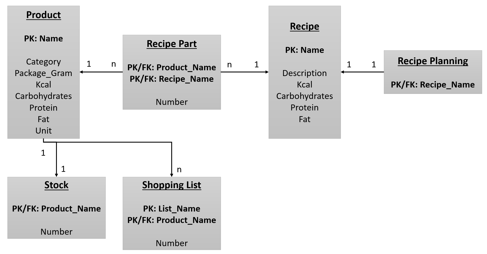
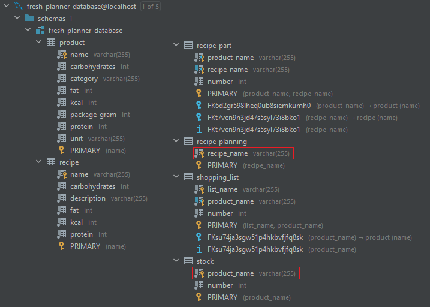

[Back to Home](https://github.com/FoodAppGroup/FoodApp-Server)

[Back to README](../README.md)

# Database

## Database Setup and Configuration

### Local Development

__MySQL Installation:__

1. Download the [Installer](https://dev.mysql.com/downloads/installer/).
2. Install the `Server only!`
3. Configure the Server:
   * Default Network with `Port: 3306`
   * Recommended Authentication with `cashing_sha_2_password`
   * Root Password: `password`

__Prepare Database:__

1. Open the `MySQL 8.0 Command Line Client`
2. Login with the password: `password`
3. Create the Database: `CREATE DATABASE fresh_planner_database;`

### Container

Defined in the [docker-compose.yml](../docker-compose.yml).

* Host: `localhost`
* Port: `3306`
* Database: `fresh_planner_database`
* Url: `jdbc:mysql://localhost:3306/fresh_planner_database`
* Username: `root`
* Password: `password`

## Database Schemas and Configuration

The following picture is not a
valid [Entity Relationship Model](https://en.wikipedia.org/wiki/Entity%E2%80%93relationship_model), but good enough for
a small overview.

### Table Configuration

The configuration of the tables will be automatically done from [JPA](https://spring.io/guides/gs/accessing-data-jpa/)
and [Hibernate](https://hibernate.org/).

1. Run MySQL with the existing Database required [application.properties](../src/main/resources/application.properties).
2. Run the [ServerApplication](../src/main/java/com/spring/ServerApplication.java). It will create all the required
   tables.

## Issues

The tables `recipe_planning` and `stock` need to have their primary key also as foreign key to the product and recipe. I
have not found a solution for this, because there are `NullPointer` or wrong `IDs` for
the [Repositories](../src/main/java/com/spring/database/repository).

## Data Backup

The plan is to save the tables as backup in excel-files. They are stored in
the [resources](../src/main/resources/database_backup).

[Back to README](../README.md)

[Back to Home](https://github.com/FoodAppGroup/FoodApp-Server)

