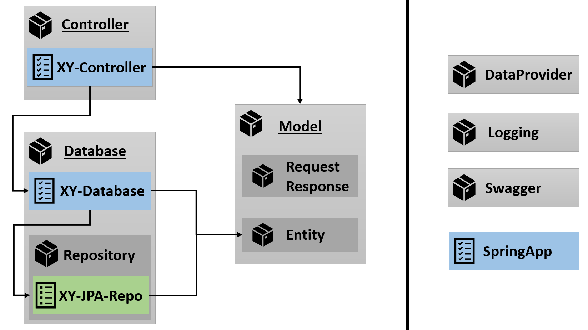

[Back to Home](https://github.com/FoodAppGroup/FoodApp-Server)

[Back to README](../README.md)

# Java Classes

The following picture is not a valid [UML Class Diagram](https://en.wikipedia.org/wiki/Class_diagram), but should give a
small overview of the idea behind the project structure.



The [ServerApplication](../src/main/java/com/spring/ServerApplication.java) will start the Spring Application with
the [controller](../src/main/java/com/spring/controller). Each controller will manage the access on
a [database](../src/main/java/com/spring/database) and these databases will implement the access on the
associated [jpa-repository](../src/main/java/com/spring/database/repository).

The `database-classes` should implement all logic for each connected [entity](../src/main/java/com/spring/model/entity).

The `controller-classes` should present the endpoints with all required [api-models](../src/main/java/com/spring/model).

## Entity classes

### Simple Entity

```java

@Data // Lombok annotation for getter, setter, toString, equals and hash methods
@NoArgsConstructor // required no args constructor for JPA with Lombok
@ApiModel // model for swagger api configuration
@Entity(name = "Entity") // JPA entity with optional name
@Table(name = "entity_name") // created table in the database
public class EntityName implements Serializable {

    @ApiModelProperty(value = "Name of the entity.", example = "example value")
    @Id // primary key annotation
    @Column(name = "key_name", nullable = false, unique = true)
    private String primaryKey;

    @ApiModelProperty(value = "Additional attribute", example = "100")
    @Column(name = "column_name", nullable = false)
    private Integer attribute;
}
```

### Entity with Foreign Key as Primary Key

Important is the `@JoinColumn` with the same name as the primary key column. In the table will only be the primary key
column and jpa will fill the Object field with the correct value within a query on
the [jpa-repository](../src/main/java/com/spring/database/repository).

```java

@Data // Lombok annotation for getter, setter, toString, equals and hash methods
@NoArgsConstructor // required no args constructor for JPA with Lombok
@ApiModel // model for swagger api configuration
@Entity(name = "Entity") // JPA entity with optional name
@Table(name = "entity_name") // created table in the database
public class EntityName implements Serializable {

    @ApiModelProperty(value = "Primary key", example = "example value")
    @Id
    @Column(name = "key_name", nullable = false, unique = true)
    private String primaryKey;

    @ApiModelProperty(value = "Additional attribute", example = "100")
    @Column(name = "column_name", nullable = false)
    private Integer attribute;

    @ApiModelProperty(value = "Reference to an object.")
    //@MapsId //TODO -> will create the table with a foreign key, but crash the repository
    @OneToOne
    @JoinColumn(name = "reference_name", referencedColumnName = "key_name", insertable = false, updatable = false)
    private Object object;
}
```

__Issue:__

The marked TODO is a not solved problem. It will create the table correct, but the repository will be crashed. The
workaround is the not perfect table, with an extended foreign key logic in
the [database](../src/main/java/com/spring/database).

### Entity with two Primary Keys

I would have preferred the `@IdClass` annotation instead of the `@EmbeddedId`, but I only got exceptions with it.
Surprising is the working foreign key as primary key in the `@Embeddable-Key`.

```java

@Data // Lombok annotation for getter, setter, toString, equals and hash methods
@NoArgsConstructor // required no args constructor for JPA with Lombok
@ApiModel // model for swagger api configuration
@Entity(name = "Entity") // JPA entity with optional name
@Table(name = "entity_name") // created table in the database
public class EntityName implements Serializable {

    @EmbeddedId
    private Key key;

    @ApiModelProperty(value = "Additional attribute", example = "100")
    @Column(name = "column_name", nullable = false)
    private Integer attribute;

    @ApiModelProperty(value = "Reference to an object.")
    @ManyToOne
    @JoinColumn(name = "reference_name", referencedColumnName = "key_name", insertable = false, updatable = false)
    private Object object;

    //=============================================================================================================

    @Data
    @NoArgsConstructor
    @AllArgsConstructor
    @ApiModel
    @Embeddable
    public static class Key implements Serializable {

        @ApiModelProperty(value = "List name.", example = "example value")
        @Column(name = "key_name", nullable = false)
        private String primaryKey;

        @ApiModelProperty(value = "Linked product name.", example = "example value")
        @Column(name = "reference_name", nullable = false)
        private String referenceKey;
    }
}
```

## Useful Links

* [Entity Key Variants](https://www.objectdb.com/java/jpa/entity/id)
* [@JoinColumn](https://www.baeldung.com/jpa-join-column)
* [@ManyToMany](https://www.baeldung.com/jpa-many-to-many)
* [Foreign Key as Primary Key](https://stackoverflow.com/questions/31385658/jpa-how-to-make-composite-foreign-key-part-of-composite-primary-key)
* [JPA Repository @Queries](https://www.baeldung.com/spring-data-jpa-query)

[Back to README](../README.md)

[Back to Home](https://github.com/FoodAppGroup/FoodApp-Server)
