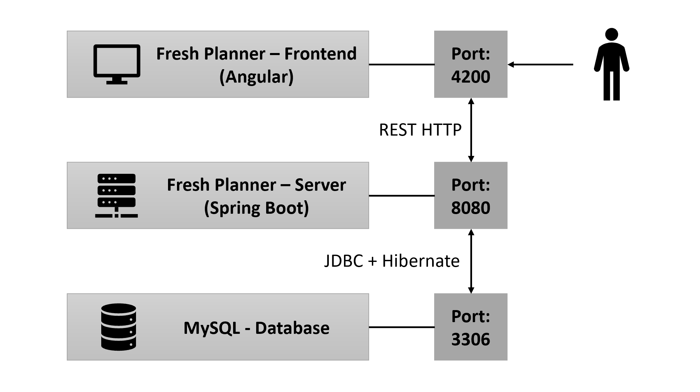

# Fresh Planner

This Backend depends on a MySQL-Database and provides a backend for it. Read the `Database Information` for more details
and open http://localhost:8080/swagger-ui/ to see the provided endpoints.

## Useful Links

* [Swagger Tutorial](https://www.baeldung.com/swagger-2-documentation-for-spring-rest-api)
* [Http Codes](https://en.wikipedia.org/wiki/List_of_HTTP_status_codes)
* [Lombok Documentation](https://projectlombok.org/features/Data)
* [Lombok IntelliJ Plugin](https://plugins.jetbrains.com/plugin/6317-lombok)
* [CodeCoverageRepo](https://about.codecov.io/)
* [Docker Image](https://hub.docker.com/r/felixsteinke/private/tags)
* http://localhost:8080/swagger-ui/

## Database Information

All details can be found in this file: [Database Information](.documentation/database.md)

## JPA Class Information

All details can be found in this file: [Classes Information](.documentation/java_classes.md)
